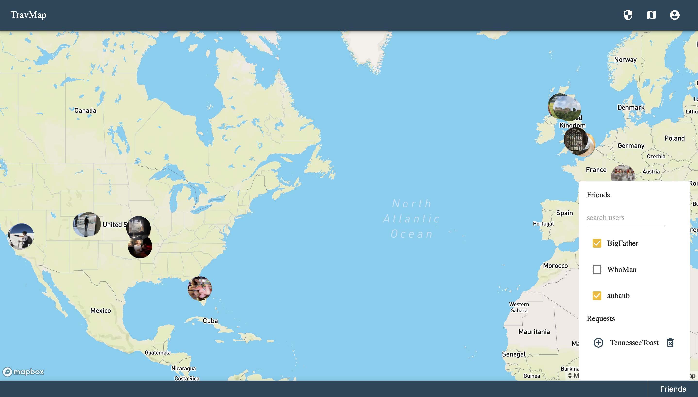
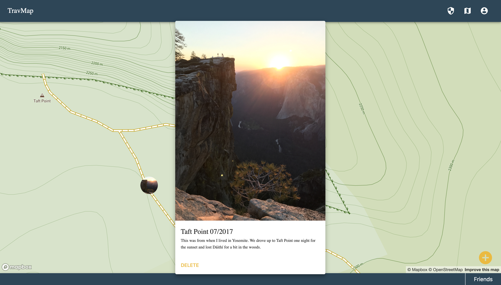
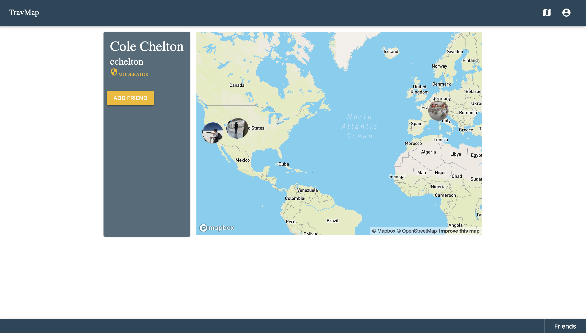
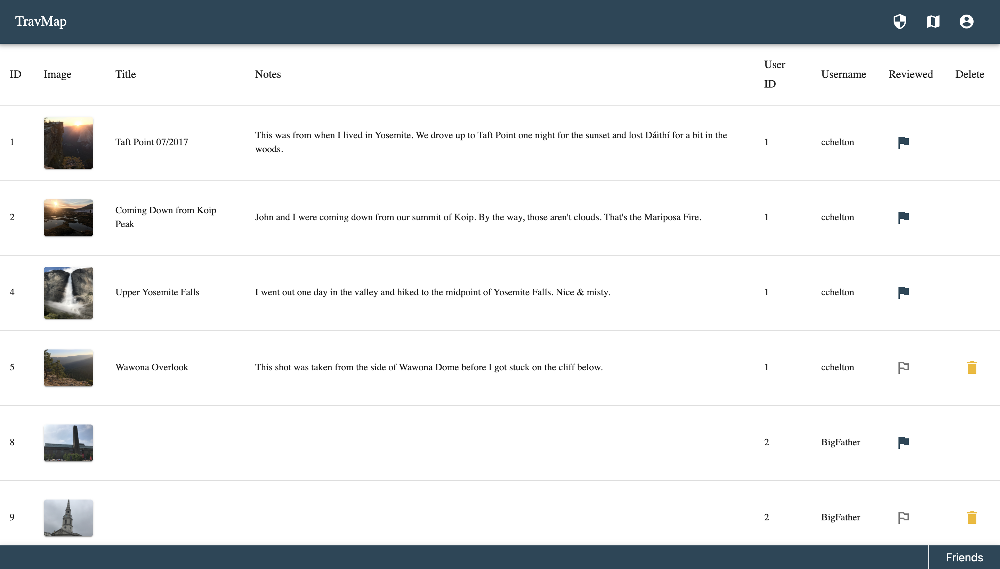

# TravMap

## Description

_Duration: 2 Week Sprint_

Whenever I travel, people usually ask where I went and to see pictures. I made TravMap as a network to easily share travel photos with friends.

To see the functioning application, please visit: [TravMap](https://travmap.herokuapp.com)

## Screen Shot

See all your and your friends' photos on the map. Also, toggle seeing your friends' photos from the Friends List.

Click a photo on the map to expand it.

View a single person's photos.

Moderate the network. Flag images for review. Delete offensive photos.

### Prerequisites

Link to software that is required to install the app (e.g. node).

- [Node.js](https://nodejs.org/en/)
- [PostgreSQL](https://www.postgresql.org/)

## Installation

1. Create a database named `travmap`,
2. Run the queries in `database.sql`. This will create the necessary tables for the TravMap. It is built on [Postgres](https://www.postgresql.org/download/), so you will need to have that installed. I recommend [Postico](https://eggerapps.at/postico/) to run your queries.
3. Navigate to the TravMap directory in your terminal.
4. Run `npm install` to install the necessary dependencies
5. Register for API Keys
    * [Amazon Web Services S3](https://aws.amazon.com/s3/) (AWS S3)
    * [OpenCage Geocoder](https://opencagedata.com/)
    * [https://www.mapbox.com/](https://www.mapbox.com/)
6. Set Environmental Variables.
    * SERVER_SESSION_SECRET = a string of random characters with more than 8 characters. [Here's a generator](https://passwordsgenerator.net/)
    * `AWS_ACCESS_KEY_ID` = Your AWS S3 Access Key
    * `AWS_SECRET_ACCESS_KEY` = Your AWS S3 Secret Access Key
    * `REACT_APP_OPENCAGE_API_KEY` = Your OpenCage Geocoder API Key
    * `REACT_APP_MAPBOX_API_KEY` = Your MapBox API Key

<strong>EITHER</strong>

For Development:

7. Run `npm run server` to start your server.
8. Run `npm run client` to start your client.

<strong>OR</strong>

For Production:

7. Run `npm run build` to create a production build.
8. Run `npm start` to start the application server.

## Usage

TravMap has 2 types of users: everyday users and moderators.
Both users require registration / log in

### Everyday

Everyday users can post and view photos, search users and make friendships.

Posting a Photo:

1. Click the `+` in the bottom right of the map to bring up begin your post.
2. A drop zone pops up for adding images, drag and drop an image into the dotted border or click within the border to browse for images.
3. Enter the photo's location, title (optional) and notes (optional). Then click `POST`. This pins your photo to the map.
4. Click a photo on the map to view that photo and its details.

Adding a Friend:

1. Click `Friends` on the bottom right of your footer to expand your friends list. Toggle your friends' photos on your map with the checkboxes next to your friends' names, accept or deny incoming requests and search for users from here.
2. Click `search users` and enter the username of the person you are looking for.
3. Press `Enter` or `Return` to search. You will be brought to that users page. On this page you'll see the user's profile and a map of only their images.
4. Click `Add Friend` to add that person as a friend. If you are already friends with them, a `Remove Friend` button will be displayed. If they haven't accepted your request, a`Cancel Request` button.

Responding to Friend Requests:

1. Click `Friends` to expand your friends list.
2. Incoming requests are displayed under `Requests`. If there are none, you will not see the `Requests` section.
3. Click `+` to add a friend request
4. Click the trashcan icon to deny a friend request.

Navigation:

1. Click the avatar icon in the top right to expand the User Menu.
2. Click `Profile` to go to your page.
3. Click `LOG OUT` to log out of TravMap.
4. Click the map icon next to the avatar to go to your Home. This is the map that shows both your and your friends' images.

### Moderator

A note on moderators: Currently the only way to add moderators is to update the `moderator` column to true for the desired user in the `user` table in the `travmap` database.

1. Click the Shield on the top bar of the app. This opens the Moderation Page - a table with every post on the network.
2. Posts may be marked "reviewed" / "not reviewed" by clicking the flag icon. (solid is reviewed, outline is not)
3. Posts not marked "reviewed" may be deleted by clicking the trashcan icon.

## Built With

- React
- Redux
- Redux-Saga
- Node
- Express
- PostgreSQL
- Material-UI
- MapBox API
- OpenCage API
- AWS S3
- react-map-gl
- react-sizeme
- react-dropzone-s3-uploader
- Axios
- passport
- passport-local
- bcrypt
- body-parser
- cookie-session
- dotenv
- pg
- prop-types

## License

[MIT](./LICENSE.txt)

## Acknowledgement

Thanks to [Prime Digital Academy](www.primeacademy.io) who equipped and helped me to make this application a reality. (Thank your people)
